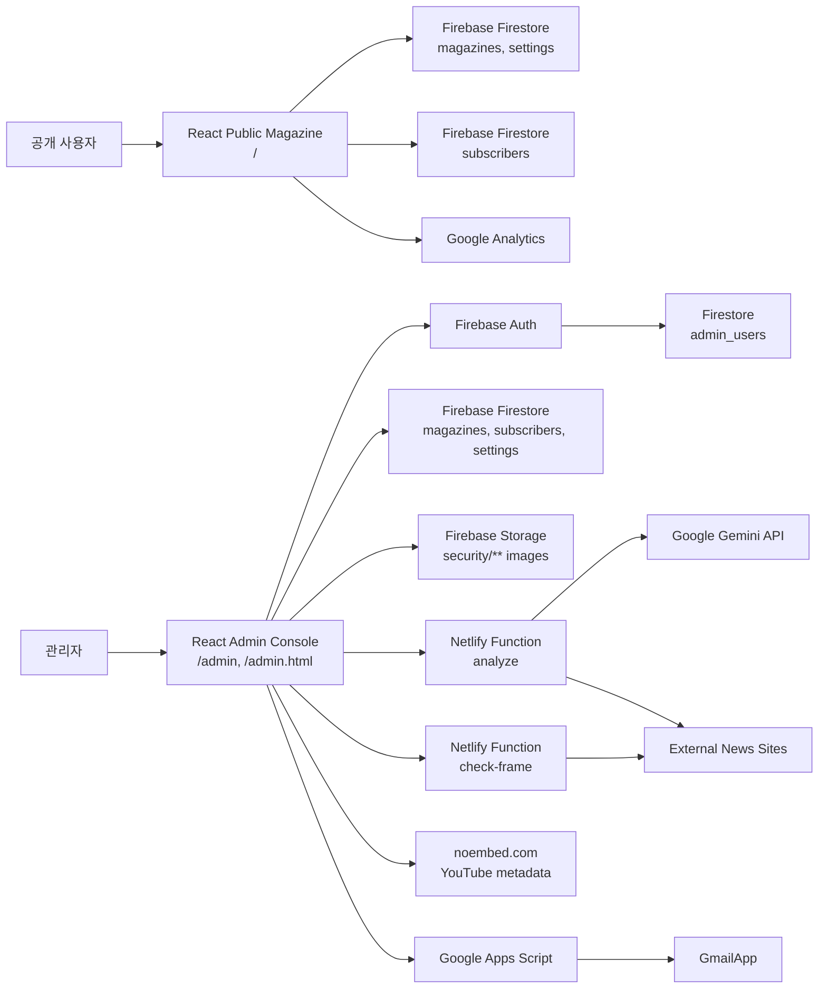
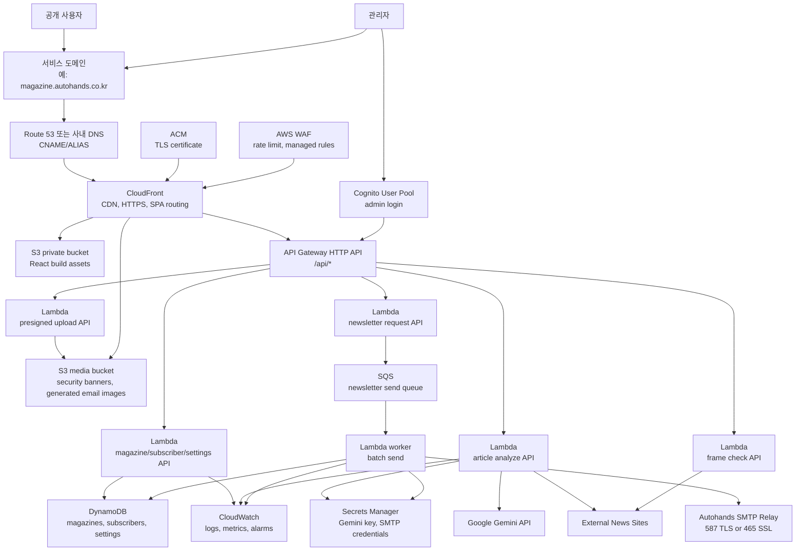
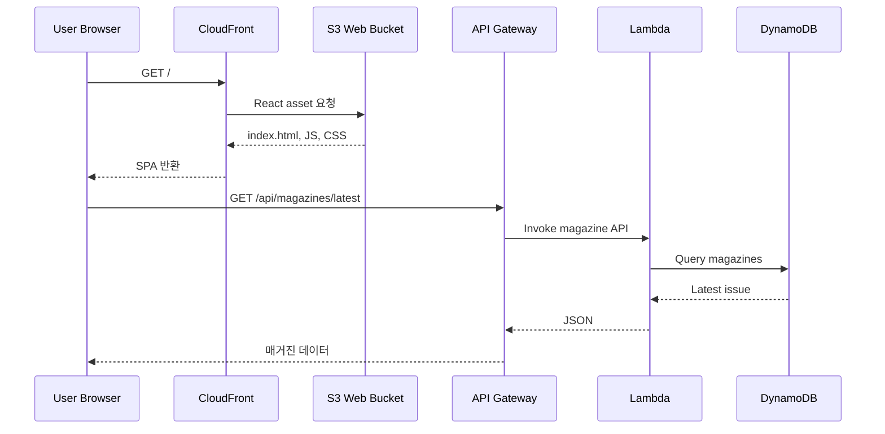
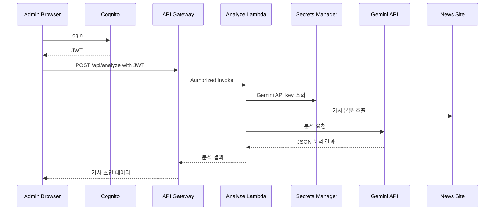
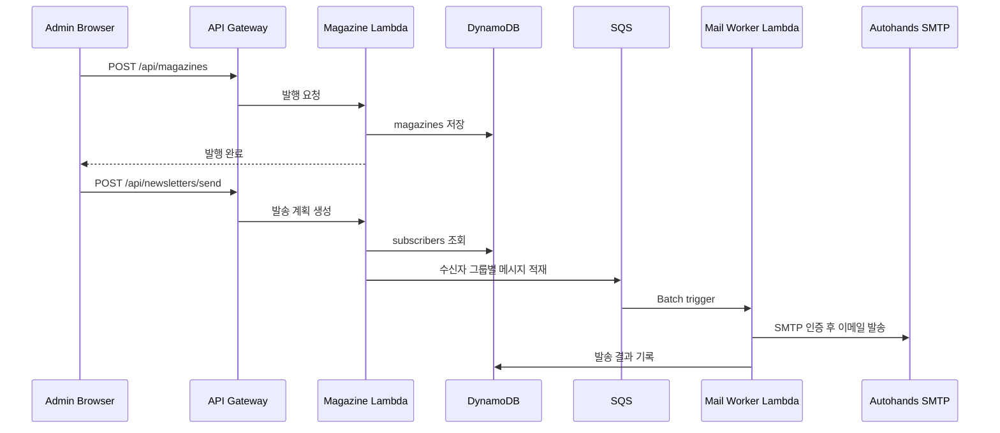

# OASIS Magazine AWS Migration Architecture

## 1. 서비스 개요

OASIS Magazine은 R&D 뉴스 매거진을 제작, 발행, 구독자에게 배포하는 React 기반 웹 서비스입니다.

- 공개 사용자: `/`에서 최신 매거진 조회, 카테고리별 기사 조회, 이메일 구독 신청
- 관리자: `/admin`, `/admin.html`에서 기사 수집, AI 분석, 매거진 발행, 구독자 관리, 캠페인/보안 배너 관리
- 외부 연동: Gemini API, YouTube noembed, Google Apps Script/Gmail, Google Analytics

## 2. 현행 서비스 구조

## 3. 현행 구성 요소

| 영역 | 현재 구성 | 코드 위치 |
| --- | --- | --- |
| Frontend | Create React App SPA | `src/App.js`, `src/AdminApp.js` |
| Public page | 공개 매거진, 구독 신청 | `src/pages/PublicMagazine.jsx` |
| Admin page | 뉴스 수집, 발행, 구독자/설정 관리 | `src/pages/*` |
| Auth | Firebase Auth 이메일 로그인 | `src/hooks/useAuth.js` |
| DB | Firestore 컬렉션: `magazines`, `subscribers`, `settings`, `admin_users` | `src/services/dataService.js` |
| File storage | Firebase Storage `security/**` | `src/pages/SecurityBanner.jsx`, `src/pages/ReportDeploy.jsx` |
| Serverless API | Netlify Functions: `analyze`, `check-frame` | `netlify/functions/*` |
| AI | Gemini API 기사 분석 | `netlify/functions/analyze.js`, `src/utils/localAnalyzer.js` |
| Newsletter | Google Apps Script가 Gmail 발송 | `docs/google-apps-script-email.gs` |
| Client settings | 일부 API URL/키가 브라우저 `localStorage`에 저장 | `src/pages/Settings.jsx`, `src/pages/ApiSettings.jsx` |

## 4. AWS 목표 아키텍처

권장 방향은 정적 웹 호스팅과 서버리스 백엔드 조합입니다. 현재 앱 규모에서는 ECS/EKS보다 운영 부담이 낮고, 기존 Netlify/Firebase 구조와도 이전 경로가 자연스럽습니다.

도메인은 운영 서비스의 필수 구성입니다. 회사가 이미 보유한 도메인 또는 신규 도메인을 기준으로 `magazine.autohands.co.kr`, `oasis.autohands.co.kr` 같은 서비스 서브도메인을 정하고, DNS는 Route 53으로 위임하거나 기존 사내 DNS에서 CloudFront로 CNAME/ALIAS를 연결합니다. HTTPS 인증서는 ACM에서 발급하고 CloudFront에 연결합니다.

## 5. AWS 서비스 매핑

| 현재 | AWS 이전 대상 | 비고 |
| --- | --- | --- |
| Netlify/Firebase Hosting | S3 + CloudFront + Route 53 + ACM | React 정적 빌드 배포 |
| Netlify Functions | API Gateway + Lambda | `/api/analyze`, `/api/check-frame` 유지 가능 |
| Firebase Auth | Cognito User Pool | 관리자 로그인 및 토큰 발급 |
| Firestore | DynamoDB | 매거진/구독자/설정 문서형 데이터에 적합 |
| Firebase Storage | S3 media bucket + CloudFront | 공개 읽기 이미지는 CloudFront, 업로드는 presigned URL |
| Google Apps Script/Gmail | Lambda worker + SQS + Autohands SMTP | 발신자는 오토핸즈 메일 계정 사용 |
| Gemini/API/SMTP key in client/localStorage | Secrets Manager or SSM Parameter Store | 서버 측 보관으로 노출 제거 |
| Google Analytics | 유지 또는 CloudWatch RUM 추가 | 기존 GA는 유지 가능 |

## 5.1 도메인 및 메일 전제

- 웹 도메인: `magazine.autohands.co.kr` 또는 인프라 팀이 지정한 서비스 도메인 필요
- 관리자 URL: 같은 도메인의 `/admin` 경로 사용 또는 `admin-magazine.autohands.co.kr` 분리 가능
- DNS 방식: Route 53 hosted zone 위임 또는 기존 DNS에서 CloudFront distribution으로 CNAME/ALIAS 등록
- 인증서: ACM 인증서를 CloudFront에 연결. CloudFront용 ACM 인증서는 `us-east-1`에서 발급 필요
- 메일 발신자: `oasis@autohands.co.kr`, `rnd-news@autohands.co.kr` 등 회사 SMTP에서 허용된 계정 사용
- SMTP 연결: 가능하면 587 STARTTLS 또는 465 SSL 사용. AWS는 25번 포트 발송 제약이 있어 25번만 가능한 SMTP는 별도 해제/네트워크 검토 필요
- SMTP 접근 제어: 오토핸즈 SMTP가 IP allowlist를 요구하면 Lambda를 VPC에 넣고 NAT Gateway 고정 EIP로 외부 발신
- 사내망 전용 SMTP: 외부 공개 SMTP가 아니라면 Site-to-Site VPN, Direct Connect, 또는 사내 릴레이 서버 구성이 필요
- 메일 인증: 발송 도메인 SPF/DKIM/DMARC 정책과 SMTP relay 정책을 인프라/보안팀과 확인

## 6. 주요 서비스 플로우

### 6.1 공개 매거진 조회

### 6.2 관리자 기사 분석

### 6.3 매거진 발행 및 뉴스레터 발송

## 7. 권장 마이그레이션 단계

### Phase 1. AWS 호스팅/API 이전, Firebase 유지

- React build를 S3 + CloudFront로 배포
- `/api/analyze`, `/api/check-frame`를 API Gateway + Lambda로 이전
- Firestore/Auth/Storage는 우선 유지
- DNS를 Route 53 또는 기존 DNS에서 CloudFront로 전환
- 장점: 위험도가 낮고, 화면/데이터 동작을 거의 그대로 유지

### Phase 2. 데이터와 인증 AWS 이전

- Firebase Auth를 Cognito로 전환
- Firestore 컬렉션을 DynamoDB로 마이그레이션
- Firebase Storage 이미지를 S3 media bucket으로 이전
- 프론트의 직접 Firebase 접근을 `/api/*` 호출로 교체
- 관리자 권한은 Cognito group 또는 custom claim 기준으로 검증

### Phase 3. 메일/운영 고도화

- Google Apps Script/Gmail 발송을 SQS + Lambda worker + Autohands SMTP로 이전
- CloudWatch alarm, DLQ, 발송 이력 테이블 추가
- WAF rate limit, API throttling, 비용 알람 구성
- Netlify/Firebase 의존성 제거

## 8. 보안/운영 고려사항

- S3 웹 버킷은 public access block 유지, CloudFront OAC로만 접근
- Admin API는 Cognito JWT authorizer 적용
- Public write API인 구독 신청은 rate limit, CAPTCHA 또는 WAF 룰 검토
- Gemini API key와 SMTP 계정/비밀번호는 Secrets Manager에 저장
- CORS는 운영 도메인만 허용
- Lambda 로그에 이메일 주소, API key, 기사 전문이 과도하게 남지 않도록 마스킹
- SMTP 계정/비밀번호는 Secrets Manager에 저장하고 주기적 교체 정책 적용
- SMTP는 587 STARTTLS 또는 465 SSL 사용을 우선 검토
- SMTP 서버가 회사망 내부 전용이면 VPC, NAT, VPN/Direct Connect 구성이 필요
- 발송 도메인은 SPF/DKIM/DMARC 정합성 확인 필요
- DynamoDB 백업과 PITR(Point-in-time recovery) 활성화 권장

## 9. 코드 변경 영향 범위

| 변경 | 영향 파일 |
| --- | --- |
| API endpoint AWS화 | `src/utils/apiEndpoints.js` |
| Firebase Auth 제거/대체 | `src/hooks/useAuth.js` |
| Firestore 직접 접근 제거 | `src/services/dataService.js`, `src/pages/PublicMagazine.jsx`, `src/pages/ReportDeploy.jsx` |
| Firebase Storage 업로드 대체 | `src/pages/SecurityBanner.jsx`, `src/pages/ReportDeploy.jsx` |
| Netlify Function Lambda 이전 | `netlify/functions/analyze.js`, `netlify/functions/check-frame.js` |
| 뉴스레터 발송 API/SMTP 이전 | `src/pages/ReportDeploy.jsx`, `docs/google-apps-script-email.gs` |
| 클라이언트 저장 secret 제거 | `src/pages/Settings.jsx`, `src/pages/ApiSettings.jsx` |

## 10. 인프라 팀 확인 필요 사항

- 운영 도메인명과 DNS 관리 주체: Route 53 위임 여부 또는 기존 DNS 유지 여부
- 관리자 도메인/경로 정책: `/admin` 유지 또는 별도 서브도메인 분리 여부
- AWS 계정/환경 구분: dev, staging, production
- 배포 방식: GitHub Actions, CodePipeline, 수동 배포 중 선택
- 예상 트래픽: 일 방문자, 관리자 수, 뉴스레터 구독자 수
- 이메일 발송량, 발송 계정, SMTP 호스트/포트/인증 방식
- SMTP 서버 접근 조건: 외부 접속 가능 여부, IP allowlist, VPN 필요 여부
- 발송 도메인의 SPF/DKIM/DMARC 설정 주체
- 외부 API 사용 허용 범위: Gemini, YouTube noembed, Google Analytics
- 개인정보/로그 보관 정책
- RTO/RPO 목표와 백업 요구사항
- AWS 리전: 국내 사용자가 주 대상이면 `ap-northeast-2` 우선 검토
